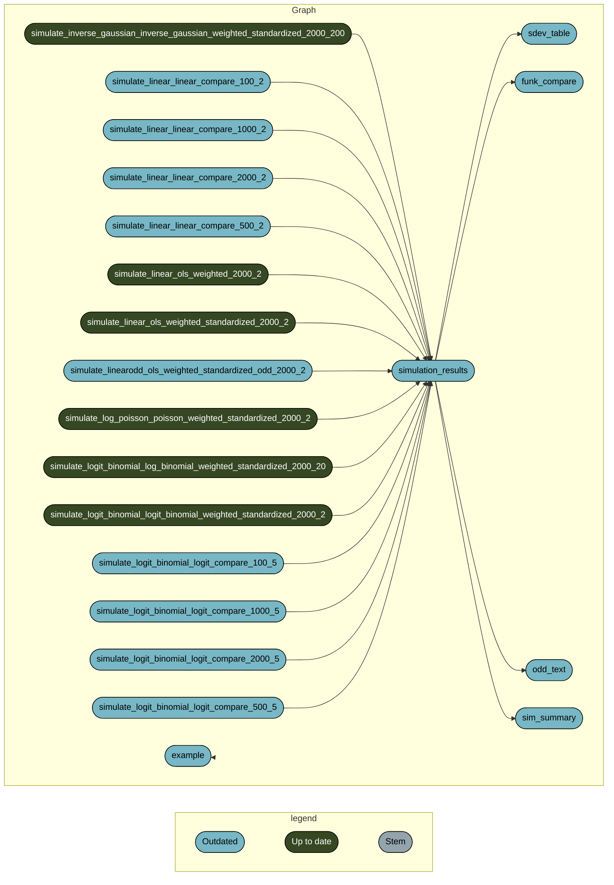

# Propensity score weighting plus regression adjustment does not equal doubly robust
## Reproducibility materials

### What is this?

This contains a series of R scripts to reproduce the simulation results in the above-titled paper. 

### How do I run this code? 

#### Prerequisites
You will need a recent version of R, along with the following packages `c("stdReg", "ggplot2", "data.table", "parallel", "sandwich")`. 

This uses the `targets` package for reproducibility. Read more about how to use it here: https://books.ropensci.org/targets/

#### Steps

1. Download the repository
2. Source the `_targets.R` script. Adjust the parameters `B` and `cores` in the 
3. Run `tar_make()` or `tar_make_clustermq()` to run the simulation. Warning, it takes a long time because each simulation replicate includes bootstrapping. 
4. Inspect the results with `tar_read(linear_summary)`. Also there is a pdf generated for the example analysis. 

```{r}
source("_targets.R")
tar_make()

tar_read(sim_summary)
tar_read(funk_compare)
tar_read(odd_text)
```


### Visualization


